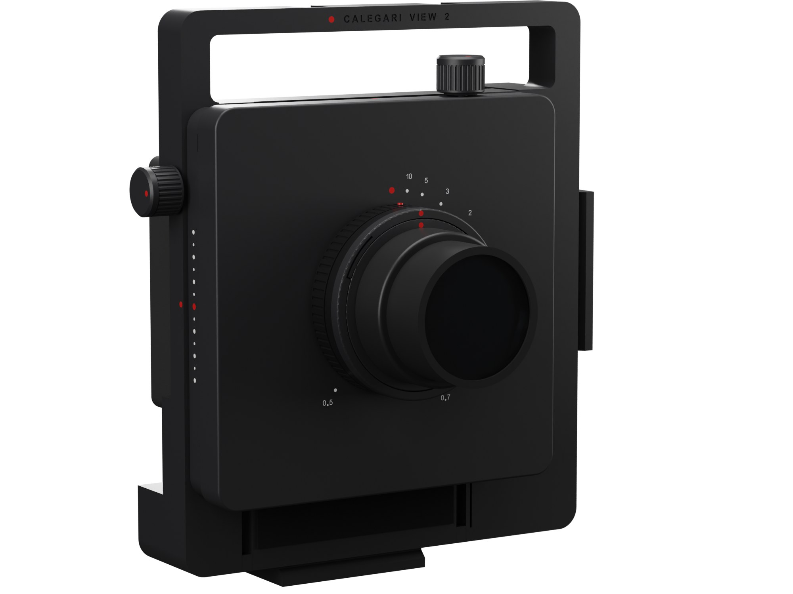
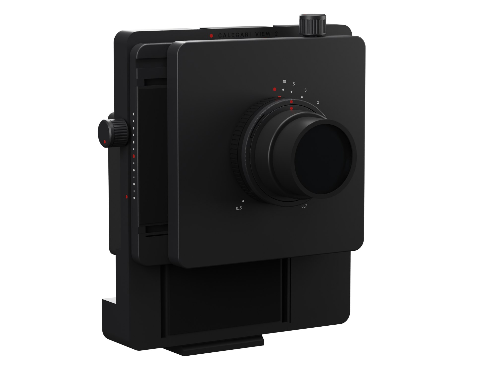
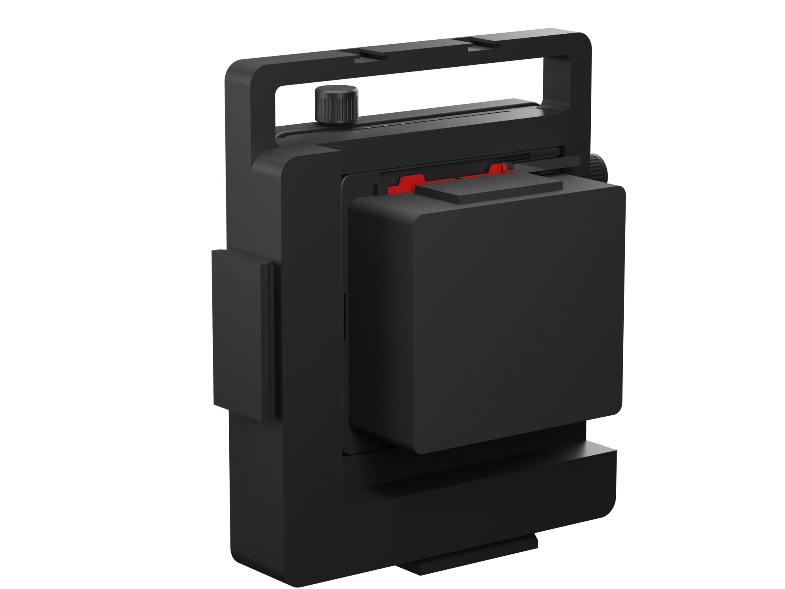

# Calegari View 2

A rigid 6x7 view camera for architecture that you print at home and put together without a single screw. No inserts, nuts, springs, bushings or grub screws: the printed parts slide in dovetails, snap together and press in. Only the focusing helicoid and a sheet of velvet are bought, then the lens and the film back.

**[Project page](https://achillecalegari.github.io/calegari-view-2/)** · [Shopping list](docs/bom.md) · [Test prints](docs/test-prints.md) · [Printing](docs/printing.md) · [Assembly](docs/assembly.md) · [Calibration](docs/calibration.md) · [Using the camera](docs/using.md) · [Design notes](docs/design.md)

## Why

[Calegari View 1](https://github.com/achillecalegari/calegari-view-1) works, but building it means buying and sorting screws, inserts and nuts in half a dozen sizes. View 2 asks what a printer can do by itself. Every fastener of View 1 has a printed answer here: dovetail ways with a flexure beam instead of a gib, rack and pinion instead of lead screws, knobs that snap onto their shafts, plugs that close the ways, a bayonet for the lens boards. It also moves further (30 mm each way instead of 25) and it looks like one object: at zero the three plates are a single square block.

## What it is

| | |
|---|---|
| Format | 6x7 (56 x 69.5 mm), Mamiya RB67 Pro, Pro-S, Pro-SD backs on a Graflok-type seat (View 1's) |
| Lens | 65 mm large-format wide angle in Copal 0 (Super-Angulon, Nikkor-SW, Grandagon-N) on a 70 mm round board, one per lens |
| Movements | rise and fall 30 mm, shift 30 mm each way; rack and pinion, 37.7 mm per turn of the knob; a click at zero, hard stops at the ends |
| Clean corners | 30 mm on one axis, 25 + 25 mm combined at infinity; the lens's image circle is the limit, not the camera |
| Focus | M65 helicoid 17 to 31 mm, turned by its own grip; engraved distance scale from infinity to 0.5 m |
| Lens change | a three-lug bayonet, a 40 degree turn and a click; the shutter always ends upright |
| Tripod | Arca-Swiss dovetails printed in the foot: under the plinth for landscape, on the side leg for portrait |
| Handle | full width, engraved name, two ISO 518 accessory shoes |
| Light seal | self-adhesive velvet between the sliding plates, at least 6.1 mm wide at every position |
| Size | 220 x 240 mm front, 161 mm deep with back and lens |
| Weight | about 1 kg without back and lens (estimate from the model) |
| Bought | the helicoid and a sheet of velvet: 40 to 70 EUR, plus ASA and a little TPU |

## How it works

| Function | How |
|---|---|
| Body | one print: body, plinth, side leg, full-width handle, both Arca dovetails, the Graflok seat |
| Ways | printed 60 degree dovetails; one groove of each pair has a flexure beam for a wall, which preloads the plate: no gib, no grubs, and it takes up wear by itself |
| Drives | module 1 rack and 12-tooth pinion, teeth printed in the bed plane. The rise pinion lives in the body, the shift pinion in the lens panel, so the shift knob rides with the lens |
| Knobs | snap onto a D-shaped shaft; a TPU wave washer under each one gives an even drag |
| Zero clicks | a flat spring cut into the moving plate's back, with a bump that drops into a dimple |
| Stops | the grooves are closed at one end; a printed plug pressed into the other end after assembly |
| Focusing | the helicoid screws into an M65 thread printed in the lens panel. Infinity sits 0.3 mm short of its closed stop, like any lens |
| Lens mount | a ring flush with the helicoid, so helicoid and mount read as one barrel; the board's plateau is printed to the lens's flange focal distance |
| Back | View 1's Graflok module, snapped into the body; a red blade in dovetail rails, clamped by a printed wheel on a printed M8 stud |

## Checked before it is printed

- `cad/check.py`: every pair of parts, at zero, at the four corners of the travel, at two single-axis ends, blade open and closed. Designed contacts (flexure preload, detent bumps, pressed racks and plugs, squeezed washers) each have a volume budget; everything else must not touch. **0 problems.**
- `cad/fitcheck.py`: the mechanisms of the test plates: bayonet in and out, rack and pinion over a tooth, the knob's snap, the dovetails, the test rig. **All pass.**
- `cad/seal_check.py`: the velvet band between the sliding plates, swept every 5 mm. **6.11 mm at the narrowest.**
- `cad/optics_check.py`: rays from the lens to the four corners of the film through every part, at infinity and focused close. **Clean at 30 mm on one axis and 25 + 25 combined at infinity; 22 + 22 at about 0.9 m.**

## Print, then build

1. [Test prints](docs/test-prints.md): four small plates that prove the thread, the bayonet, the drive and the dovetails on your printer.
2. [Printing](docs/printing.md): seven plates.
3. [Assembly](docs/assembly.md): eleven illustrated steps, no tools but scissors and a craft knife for the velvet.
4. [Calibration](docs/calibration.md): infinity, other lenses, the drag of the ways.

Everything is generated with Python and [build123d](https://github.com/gumyr/build123d) from `cad/params.py`: change a number, run `python export.py`, print.

## Licence

[CC BY-NC-SA 4.0](LICENSE): build it, change it, share it with credit; do not sell it. The RB67 interface comes from View 1, measured from [Super-67](https://github.com/DamienHazard/Super-67) and the [RB67 pinhole body](https://www.thingiverse.com/thing:7270507).
