# Assembly

[Back to the project](../README.md)

This guide assumes you have never built a camera. Each step is split into short sub-steps; every picture shows what is already built in place and only the parts of that sub-step pulled out along the way they go in, with a dashed line to where they go. The red letters match the table under the picture. Follow the steps in order: some parts cannot be reached later.

There is no screw in the camera. Parts slide in dovetails, snap onto shafts, press into slots, and one worm threads into its rack. Allow two hours for the first build.

## Words used in this guide

- **Front** is the lens side, **rear** is the film side.
- **Photographer's left and right** are as you stand behind the camera looking at the ground glass. A picture taken from the front shows them mirrored: the photographer's right is on the left of the picture.
- The **Y plate** moves up and down (rise and fall). The **lens panel** moves left and right (shift) and carries the lens. The **rotator** is the round plate at the back that carries the film back and turns it from landscape to portrait.
- A **dovetail way** is a groove with a slanted outer wall and a tongue that slides in it. In each pair, one groove has a thin slot beside its wall: that wall is a **flexure**, a spring that presses the tongue and takes out the play.
- The **worm** is the vertical screw in the handle's left post that raises the Y plate. Its **rack** is the row of teeth moulded into the back of the Y plate.
- **Proud** means sticking out above a surface; **flush** means level with it.

## Before you start

1. **Print and check the parts**: everything in [printing](printing.md), including *After printing*.
2. **Pass the test prints**: [test prints](test-prints.md) tells you whether the thread, the bayonet, the worm, the pinion and the dovetails work on your printer. Do not assemble before they pass.
3. **Clean every slot, bore and pocket** of stringing. A hair of plastic in a dovetail feels like a gritty way forever.
4. **Keep the worm dry.** No grease, no oil, no PTFE on the worm or its rack: the dry friction is what holds the front standard (see [design notes](design.md)). The dovetails and the shift rack may get one light coat of dry PTFE.

### Tools

| Tool | Used for |
|---|---|
| Sharp scissors, a new craft blade, a steel ruler | the velvet |
| A flat piece of hard wood, about 60 x 30 mm | pressing the racks and plugs |
| A small clamp or a vice (optional) | the same, if your thumbs are tired |
| A toothpick, red and white acrylic, a damp cloth | the dots and the infinity index |
| Isopropyl alcohol, cotton buds | degreasing before the velvet |

### Four techniques you will use

**1. Pressing.** The racks, the plugs and the stop peg are drawn 0.1 mm larger than their slots: they stay by friction alone. Start the part square in its slot, lay the wood on it and press with your thumb or the clamp until it is flush. Never a hammer: ASA cracks. If a part will not go, look at the slot for stringing before you push harder.

**2. Snapping a knob.** Each shaft ends in a D flat and a groove. Turn the knob until its D bore lines up with the flat, push it straight down: two tabs inside the knob spread and drop into the groove with a click. To take a knob off, pull it straight while rocking it slightly.

**3. Velvet.** Light is kept out by sliding faces 0.8 mm apart with self-adhesive velvet between them. There are two pieces, V1 on the body and V2 on the Y plate.

1. Print the templates in `print/templates/` at 100 %. Measure the 100 mm bar on the sheet: if it is not 100 mm, fix the printer scaling first.
2. Tape the template on the back of the velvet (the paper side), cut the outline with scissors and the window with the blade against the ruler.
3. Measure the velvet with a caliper, pressing lightly: 0.9 to 1.2 mm.
4. Degrease the plastic with alcohol. Peel off the backing, align one edge and lay the velvet down from that edge like a screen protector. Press it all over with your thumb.

**4. Threading the worm.** The rack meets the worm the way a nut meets a screw: it will not slide on, it has to be turned on. When a rack touches the worm, turn the rise knob slowly while you push the plate gently: the first tooth finds the thread within a turn and the knob then draws the plate along by itself.

---

## 1. Body and rise worm

**You need:** the body, the rise worm, a knob, a wave washer (TPU).

### 1a. Check the body

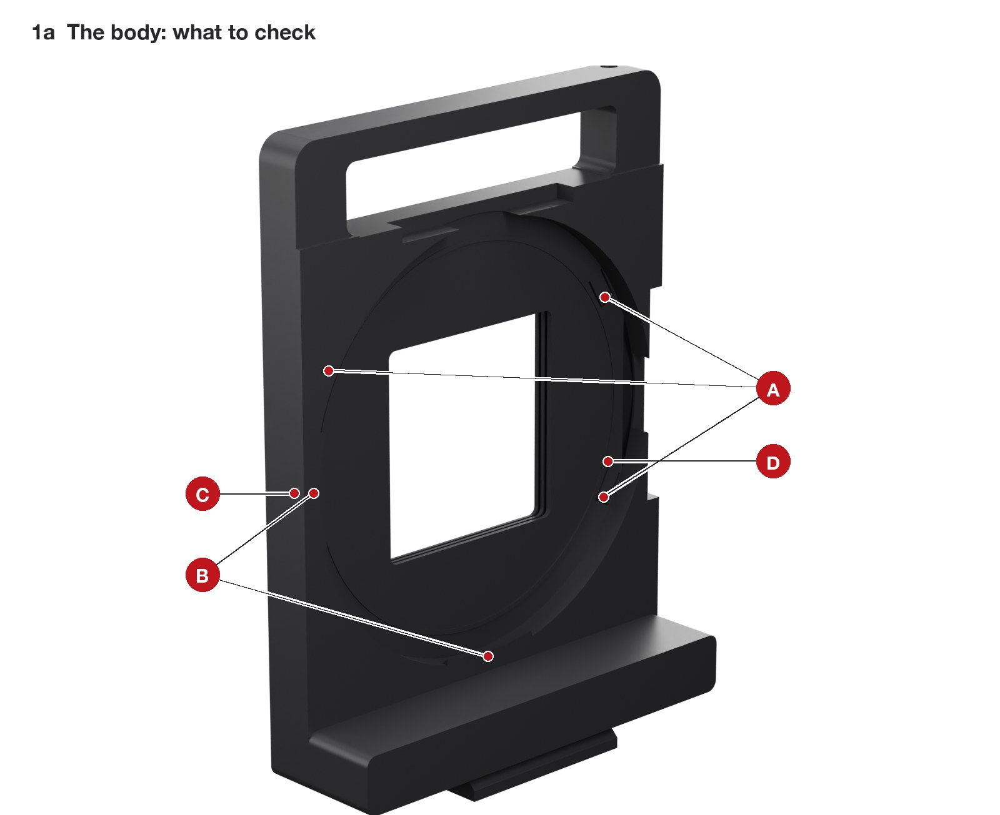

| | What | Check |
|---|---|---|
| A | Three springs in the floor of the round recess at the back | Press each one with a fingernail: it moves and comes back. The small bump on each must be clean. |
| B | Two lugs at the rim of the recess | No stringing under them: the rotator's edge slides there. |
| C | The stop peg's hole, on the photographer's left side | Open, round, clean. |
| D | The ring rib in the recess floor | Whole all the way round: it is the light trap between the rotator and the body. |

Also run a fingernail along the slit beside the groove on the photographer's left: it must be open for its whole length.

### 1b. The rise worm

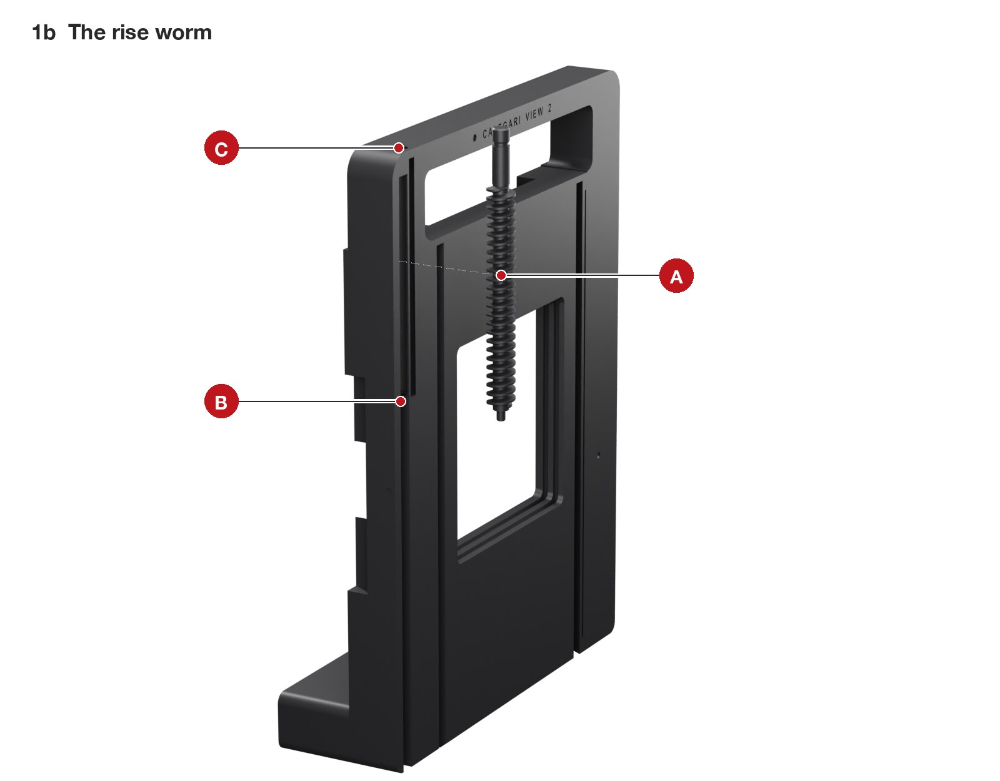

| | Part | What to do |
|---|---|---|
| A | Rise worm | Hold it by its thread, shaft up. Push the shaft up through the bearing in the handle's top (C) from inside the post, until the pin at its bottom clears the lip of the trough. Lay the worm in its trough and let it down: the pin drops into its hole (B). |
| B | Bottom hole | The pin sits in it; the pin's end is the thrust bearing that carries the front standard. |
| C | Top bearing | The shaft sticks out of the handle's top by about 10 mm. |

Turn the shaft with your fingers: the worm turns freely with no scraping.

### 1c. Washer and knob

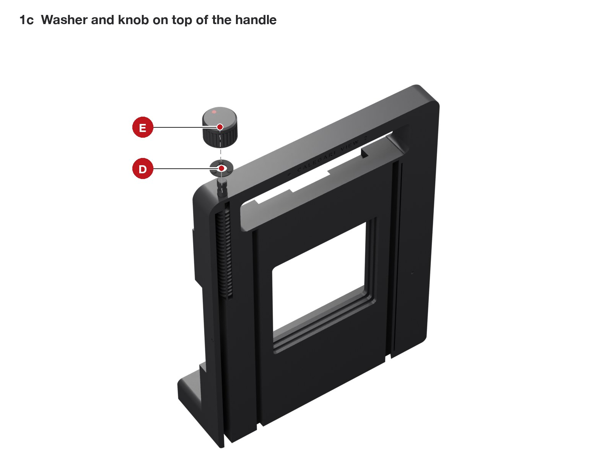

| | Part | What to do |
|---|---|---|
| D | Wave washer | Over the shaft, flat on the handle's top. |
| E | Knob | Snap it on (technique 2). It turns with a light, even drag. |

---

## 2. The rotating back

**You need:** the rotator, the stop peg, the red Graflok blade, the Graflok wheel.

### 2a. The rotator goes in

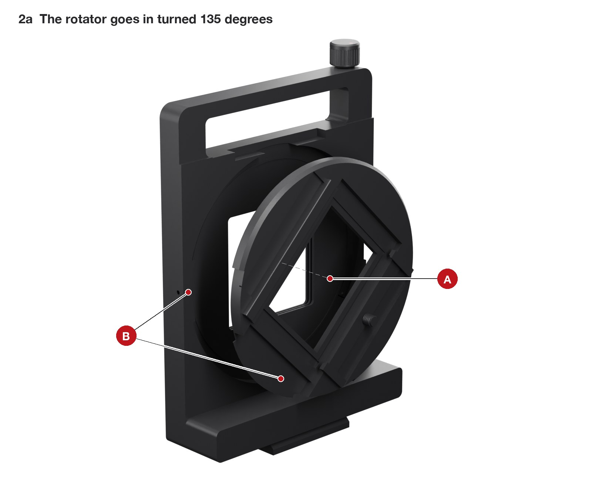

| | Part | What to do |
|---|---|---|
| A | Rotator | Seat face (the side with the rails) toward you, the flat face toward the body. Its rim has two notches: turn it until they sit on the two lugs (B), push it into the recess against the three springs, and turn it anticlockwise as you look at it until it clicks. The blade rails are then at the top: landscape. |
| B | Lugs | The rotator's bevelled edge now runs under them; the springs press it back onto them. |

### 2b. The stop peg

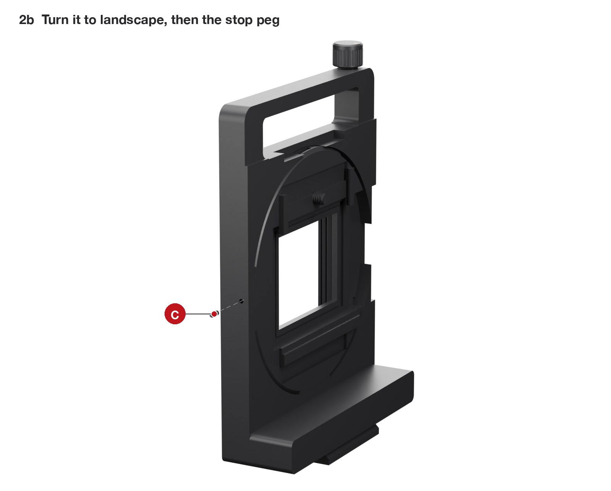

| | Part | What to do |
|---|---|---|
| C | Stop peg | Press it into the hole in the photographer's left side face, flush (technique 1). |

Now grip the rotator's rails and turn it: a quarter turn anticlockwise (seen from behind) to portrait, where it clicks and stops, and back to landscape, where it clicks and stops again. It can no longer reach the angle where it came in.

### 2c. Blade and wheel

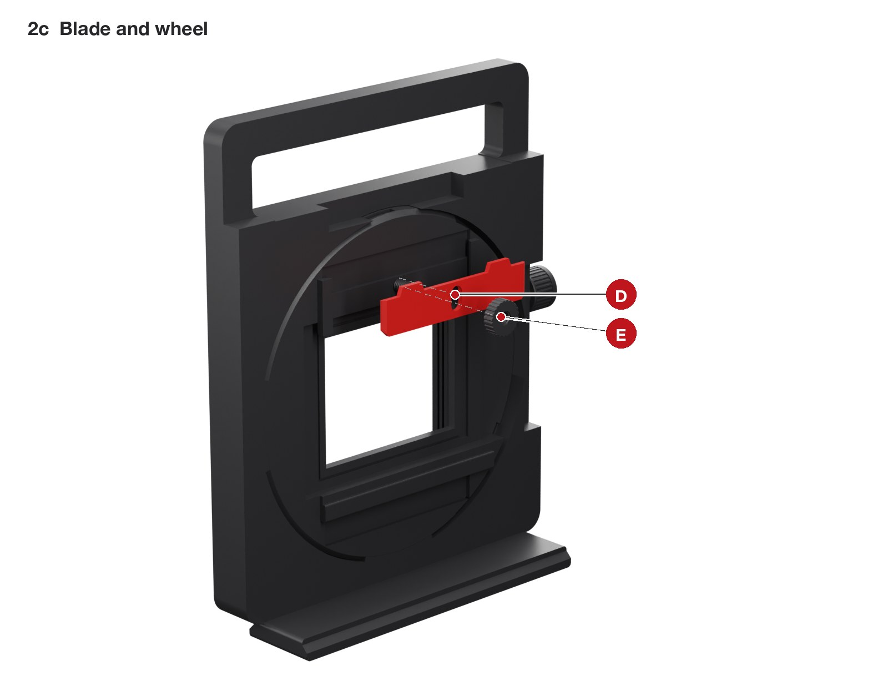

| | Part | What to do |
|---|---|---|
| D | Red blade | Slide it into the two rails on the rotator's back, from the top, its two tongues up. |
| E | Wheel | Screw it onto the printed stud through the blade's slot. Wheel loose: the blade slides; wheel tight: it is clamped. |

---

## 3. Velvet V1 on the body

**You need:** velvet V1, cut from `velvet_V1_body.svg`.

| | Part | What to do |
|---|---|---|
| V1 | Velvet | On the body's front face between the two grooves, window over the window, from the top edge down over the plinth. It must not cover the grooves, the worm's channel on the photographer's right, or the zero-click dimple (F). |

---

## 4. The Y plate on the bench

**You need:** the Y plate, the shift rack, velvet V2.

### 4a. Check its back

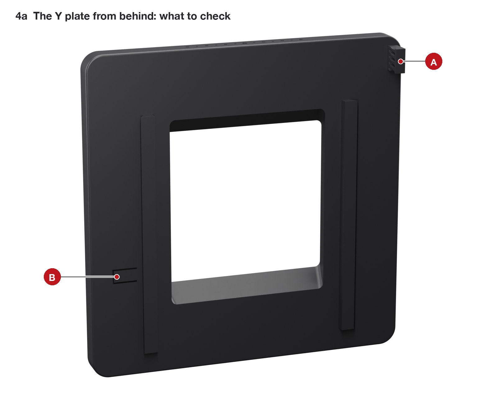

| | What | Check |
|---|---|---|
| A | The rise rack, part of the plate | Four clean teeth, no stringing between them. Do not lubricate them. |
| B | The zero-click spring | It moves when you press it with a fingernail; its bump is clean. |

### 4b. Shift rack

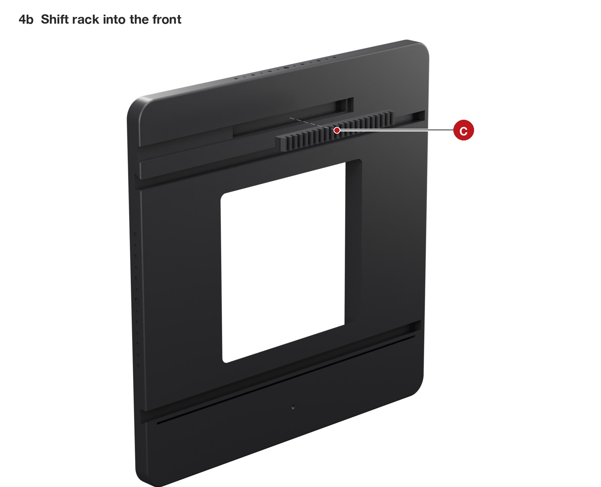

| | Part | What to do |
|---|---|---|
| C | Shift rack | Press it into the slot at the top of the plate's front, teeth out, flush (technique 1). |

### 4c. Velvet V2

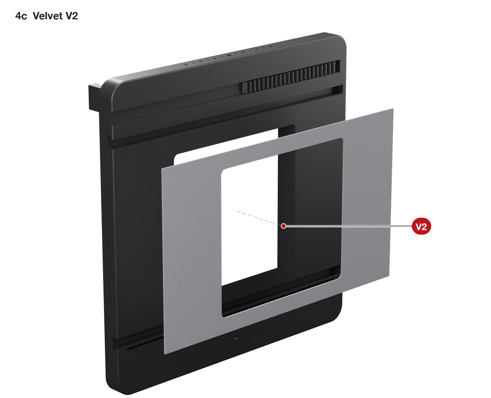

| | Part | What to do |
|---|---|---|
| V2 | Velvet | Template `velvet_V2_y_plate.svg`, on the front between the two grooves. The shift rack and the channel above it stay clear. |

---

## 5. The Y plate into the body

**You need:** the Y plate as built in step 4, two plugs Y.

### 5a. Up from below

| | Part | What to do |
|---|---|---|
| A | Y plate | Hold it under the camera, rear toward the body, its two tongues in the body's two grooves, and slide it up from the bottom of the plinth. The rise rack runs up the channel on the photographer's right. |
| B | Rise knob | When the rack reaches the worm the plate stops: turn the knob clockwise (seen from above) while you push gently (technique 4). The worm draws the plate up. Keep turning to the top, where it stops. |

### 5b. The plugs

| | Part | What to do |
|---|---|---|
| C | Two plugs Y | Press them into the bottom ends of the two grooves, under the plinth, flush. They stop the fall and keep the plate in. |

Turn the rise knob through the whole travel, 60 mm: about 19 turns, even all the way, one click at zero. Let go anywhere: the plate stays.

---

## 6. The lens panel on the bench

**You need:** the lens panel, the shift pinion.

| | Part | What to do |
|---|---|---|
| A | Shift pinion | From behind, drop it into its pocket at the top of the panel and push the shaft up through the top edge. It stays loose until the panel is in. |
| B | Zero-click spring | As on the Y plate. |

---

## 7. The lens panel onto the Y plate

**You need:** the lens panel with its pinion, two plugs X, a wave washer, the second knob.

### 7a. In from the photographer's right

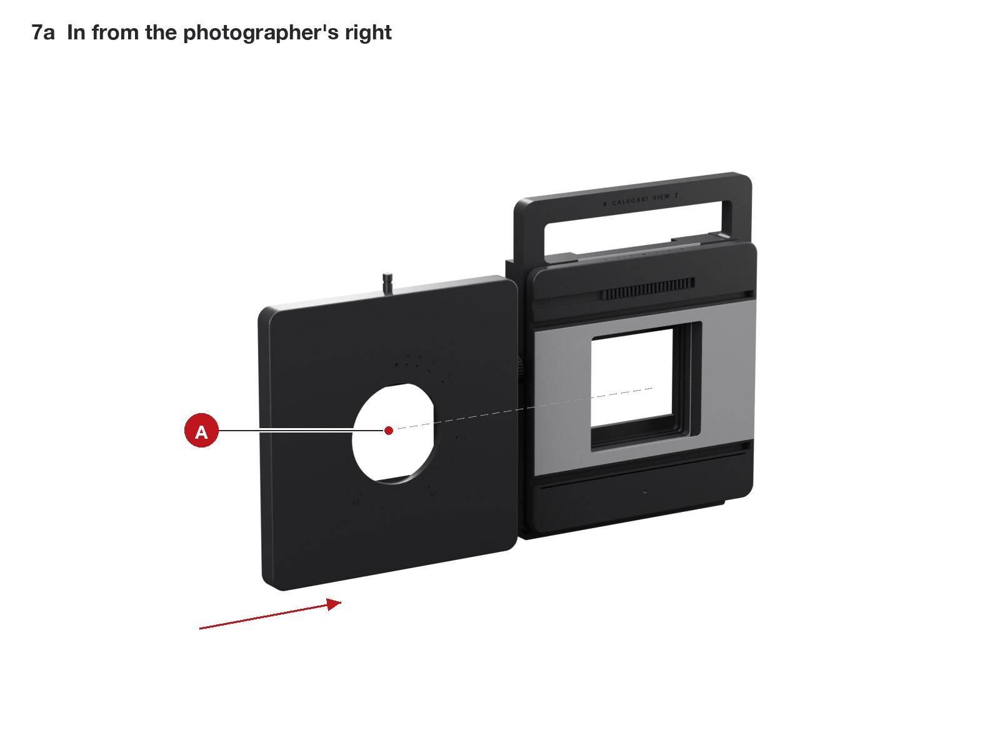

| | Part | What to do |
|---|---|---|
| A | Lens panel | Hold it with the pinion's shaft up and slide it into the Y plate's grooves from the photographer's right. The pinion runs in the channel at the top of the Y plate and meets the shift rack: rock the shaft with your fingers as you push, the teeth engage. Keep going until the panel stops. |

### 7b. The plugs

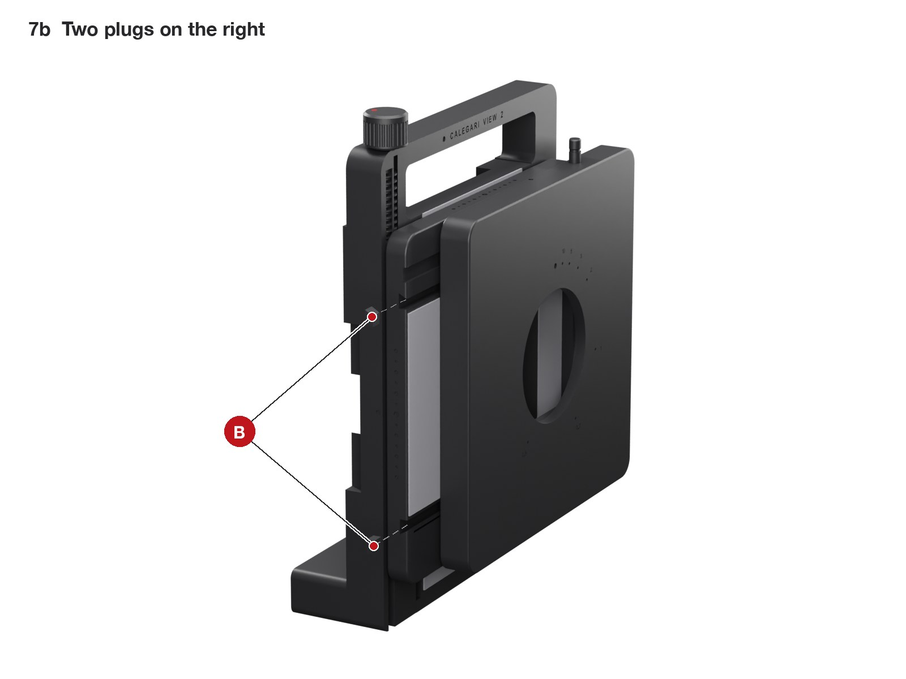

| | Part | What to do |
|---|---|---|
| B | Two plugs X | With the panel pushed fully to the photographer's left, press them into the right-hand ends of the two grooves, flush. They stop the shift and keep the panel in. |

### 7c. Washer and knob

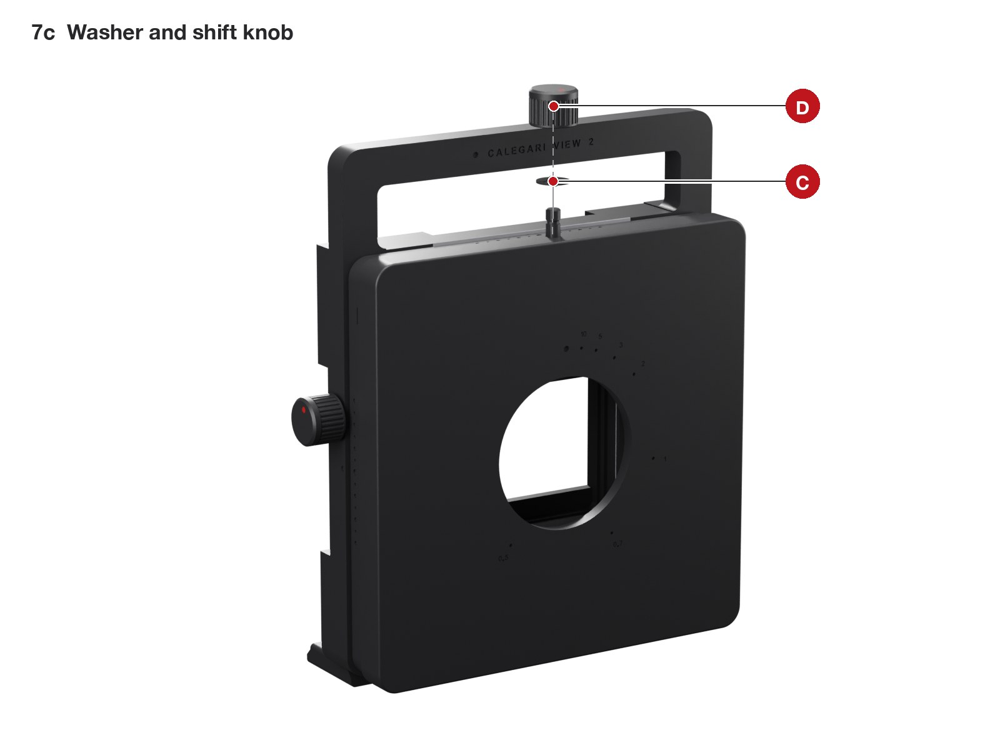

| | Part | What to do |
|---|---|---|
| C | Wave washer | Over the shaft, on the panel's top edge. |
| D | Knob | Snap it on. The shift knob rides with the lens: one turn moves the panel 37.7 mm. |

---

## 8. The barrel

**You need:** the helicoid, the lens mount.

### 8a. Helicoid

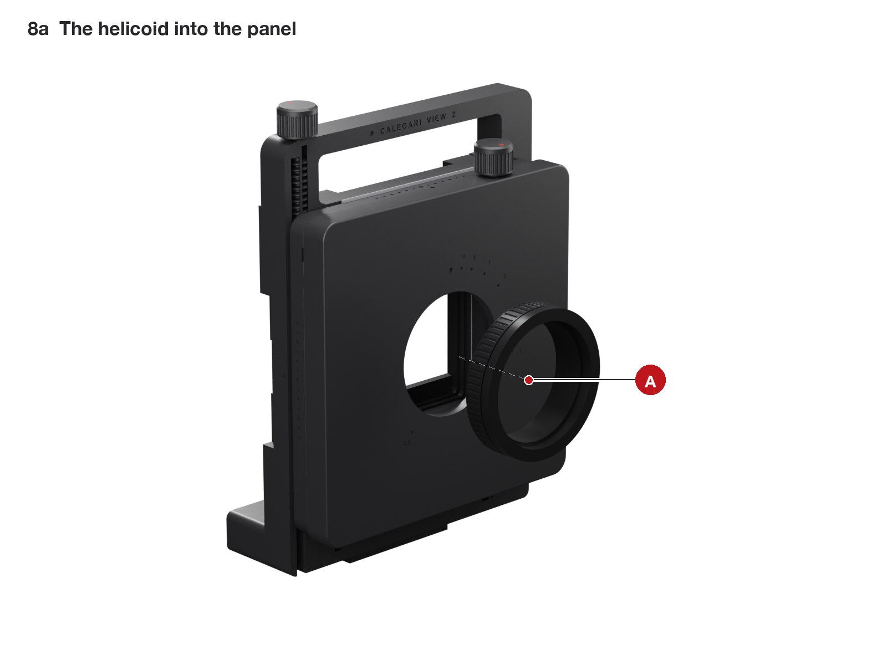

| | Part | What to do |
|---|---|---|
| A | Helicoid | Screw its rear thread into the panel's printed thread, by hand, until it seats. Hold the rear and turn the grip: the front must come out without rotating. |

### 8b. Lens mount

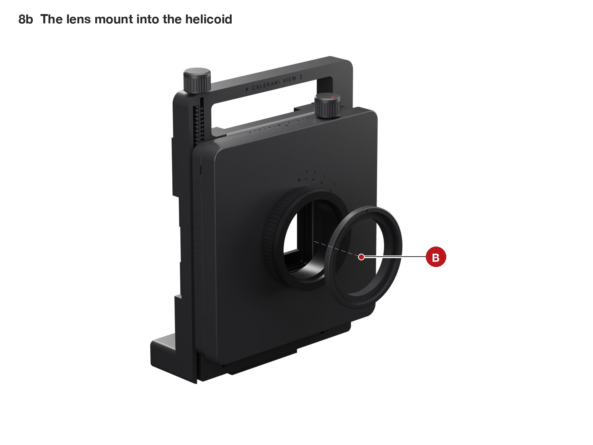

| | Part | What to do |
|---|---|---|
| B | Lens mount | Screw it into the helicoid's front until it seats. Its red dot ends where it ends: that is fine, the board's lock is what sets the shutter upright. |

---

## 9. The lens

**You need:** the lens board, the lens with its retaining ring.

### 9a. The lens on its board

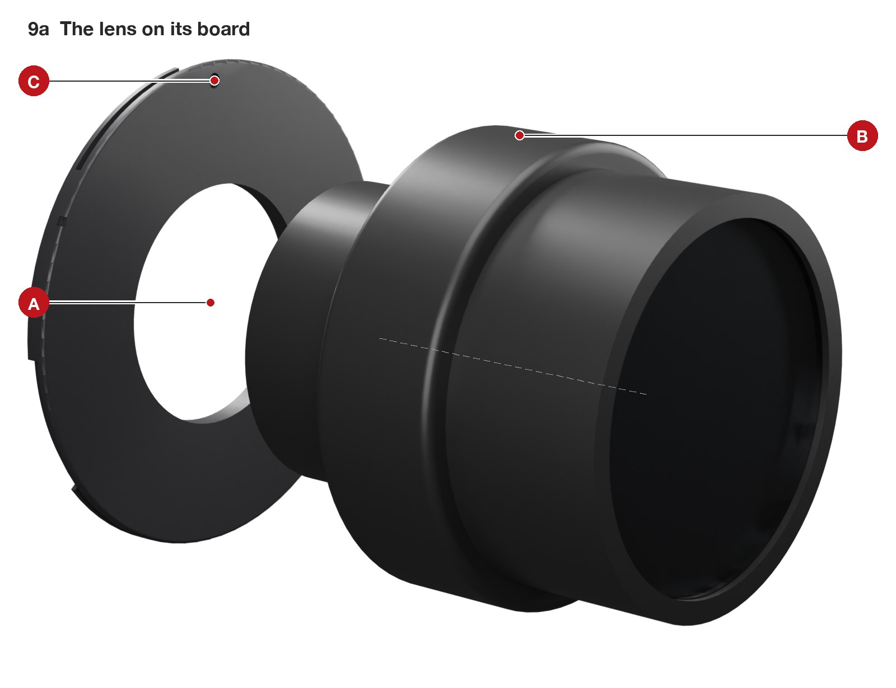

| | Part | What to do |
|---|---|---|
| A | Lens board | |
| B | Lens | Remove the rear cell, put the shutter on the board's front, the rear cell and the retaining ring through from behind. Before you tighten the ring, turn the shutter so that its scales face up and the release lever is where you want it when the board's red dot (C) is at the top. Tighten the ring by hand. |

### 9b. The board into the mount

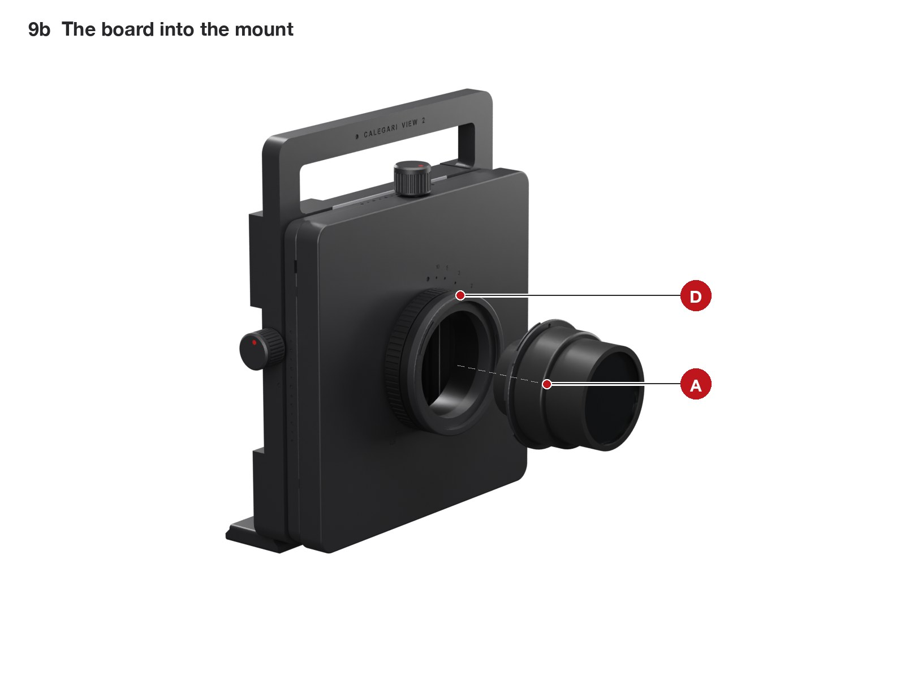

| | Part | What to do |
|---|---|---|
| A | Board | Facing the front of the camera, put it in turned about 40 degrees anticlockwise (its red dot left of the mount's red dot, D), push it flat and turn it clockwise until it clicks: the red dots meet, the shutter is upright. To take it out, turn it back firmly. |

---

## 10. The back

**You need:** a Mamiya RB67 back, or the ground glass back.

### 10a. Landscape

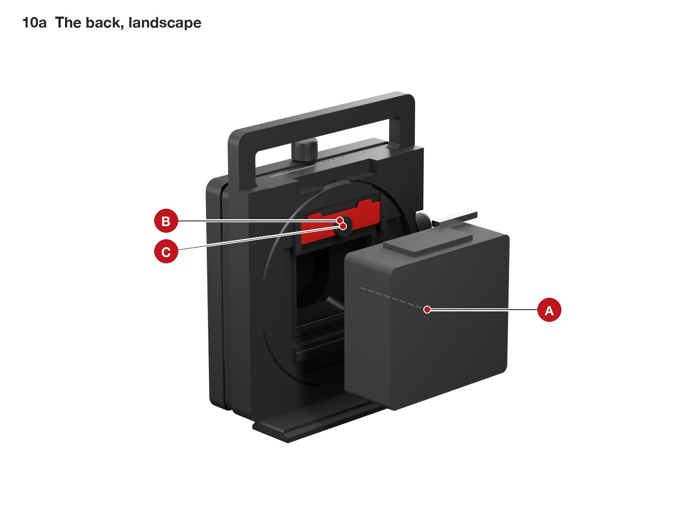

| | Part | What to do |
|---|---|---|
| A | Back | Wheel (C) loose, blade (B) down. Hook the back's lower edge under the rotator's bottom rail, swing it on, push the blade up and tighten the wheel. The dark slide comes out on the photographer's right. |

### 10b. Portrait

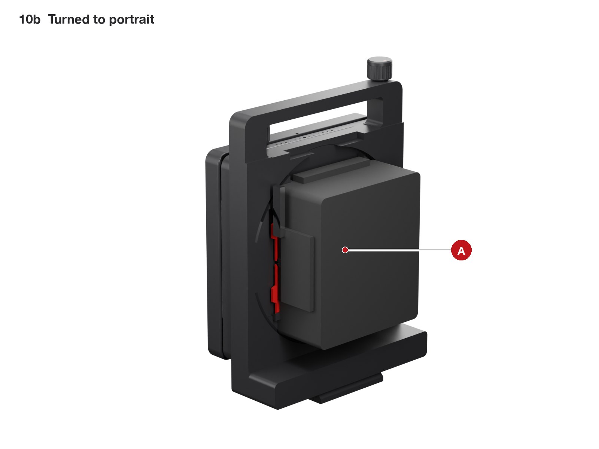

Grip the back and turn it a quarter turn anticlockwise, as you look at it from behind, until it clicks: portrait. The dark slide now comes out at the top, under the handle. The camera stays level on the tripod; only the film turns. Turn it back the same way.

---

## 11. Infinity and the index

1. Ground glass on, shutter open at full aperture, something far away in the frame (a kilometre is plenty).
2. Turn the helicoid's grip until the far object is sharp in the loupe. It will be a few degrees before the grip's closed stop: that margin is by design, as on any lens.
3. With a toothpick, put a drop of red acrylic on the grip, exactly under the red dot of the distance scale on the panel.

From now on the index shows the distance on the scale. If infinity is not reached before the stop, or it is more than 30 degrees before it, see [calibration](calibration.md).

## Last checks

| Check | Good |
|---|---|
| Rise knob, the whole travel | even, one click at zero, the plate stays wherever you let go, even with the lens on |
| Shift knob, the whole travel | even, one click at zero, hard stops at 30 mm |
| The back, landscape to portrait | a quarter turn, a click and a stop at each end |
| Light test | [calibration](calibration.md), section 1 |
