# Assembly

[Back to the project](../README.md)

No tools but scissors and a craft knife for the velvet. Print the [test plates](test-prints.md) first; everything below assumes they passed. Every picture shows what is already built in place and only the parts of that step pulled out along the way they go in; the red letters match the table under the picture.

About two hours for the first build.

## Words used in this guide

- **Front** is the lens side, **rear** is the film side.
- **Photographer's left and right** are as you stand behind the camera looking at the ground glass. A picture taken from the front shows them mirrored.
- The **Y plate** moves up and down (rise and fall). The **lens panel** moves left and right (shift) and carries the lens.
- A **dovetail way** is a groove with a slanted outer wall and a tongue that slides in it. In each pair, one groove has a thin slot beside its wall: that wall is a **flexure**, a spring that presses the tongue and takes the play out.
- **Proud** means sticking out above a surface; **flush** means level with it.

## Velvet

The camera has no bellows: light is kept out by sliding faces 0.8 mm apart with self-adhesive velvet between them. There are two pieces, V1 on the body and V2 on the Y plate.

1. Print the templates in `print/templates/` at 100 %. Measure the 100 mm bar on the sheet: if it is not 100 mm, fix the printer scaling first.
2. Tape the template on the back of the velvet (the paper side), cut the outline with scissors and the window with a craft knife against a ruler.
3. Degrease the plastic with alcohol. Peel off the backing, align one edge and lay the velvet down from that edge like a screen protector. Press it all over with your thumb.

---

## 1. Graflok module, blade and wheel

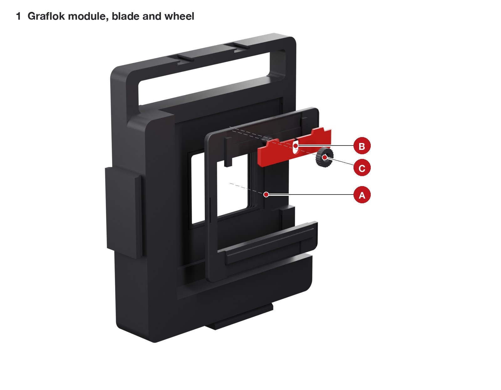

| | Part | What to do |
|---|---|---|
| A | Graflok module | Push it into the body's rear recess, seat face first. Three hooks click into the recess walls. |
| B | Red blade | Slide it into the two rails on the module's rear, from the top, tongues up. |
| C | Wheel | Screw it onto the printed stud through the blade's slot. Wheel loose: the blade slides; wheel tight: it is clamped. |

## 2. Rise drive

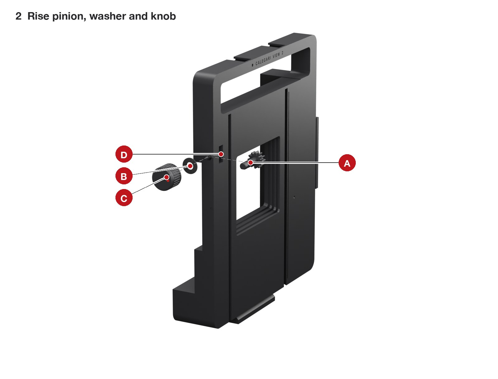

| | Part | What to do |
|---|---|---|
| A | Rise pinion | From the front, drop it into its round pocket (D) on the photographer's right and push the shaft out through the side face. |
| B | Wave washer | Over the shaft, against the side face. |
| C | Knob | Onto the shaft, flat to flat, and push until it clicks. It turns with an even drag. |

## 3. Velvet V1 on the body

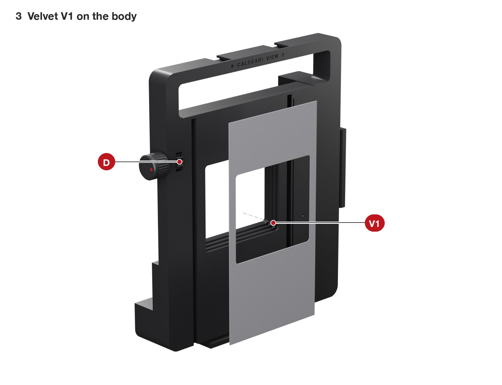

Template `velvet_V1_body.svg`. It goes on the body's front face between the two grooves, window over the window, from the top edge down over the plinth. It must not cover the pinion pocket (D) or the grooves.

## 4. Racks and velvet V2 on the Y plate

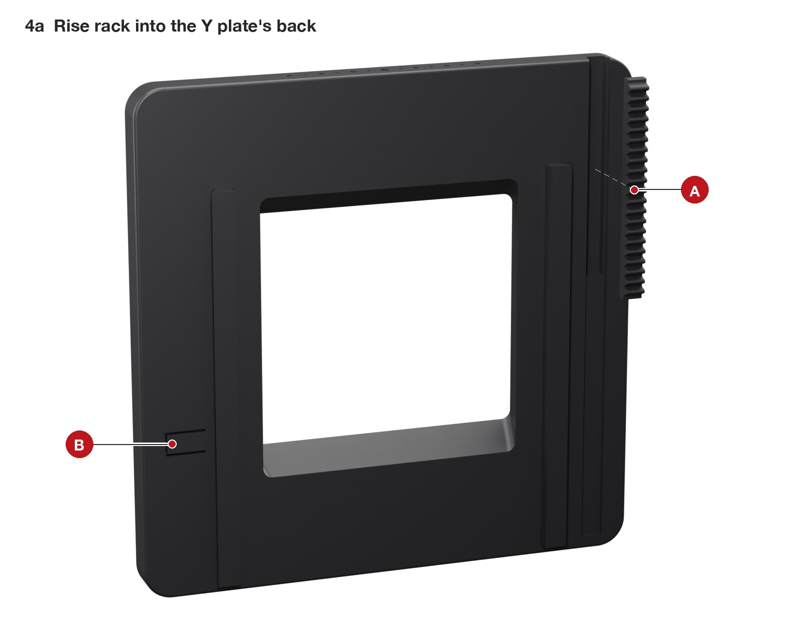

| | Part | What to do |
|---|---|---|
| A | Rise rack | Press it into the slot in the plate's rear, teeth out, flush with the top edge. A flat piece of wood and your thumb are enough. |
| B | Zero-click spring | Nothing to do: check that it moves when you press it with a fingernail. |

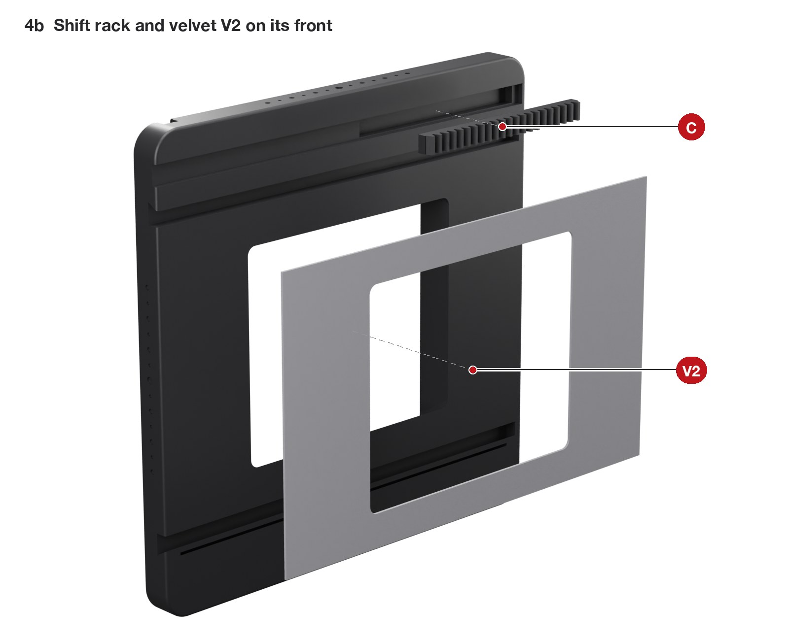

| | Part | What to do |
|---|---|---|
| C | Shift rack | Press it into the slot in the plate's front, teeth out, at the top. |
| V2 | Velvet | Template `velvet_V2_y_plate.svg`, on the front between the two grooves. |

## 5. The Y plate into the body

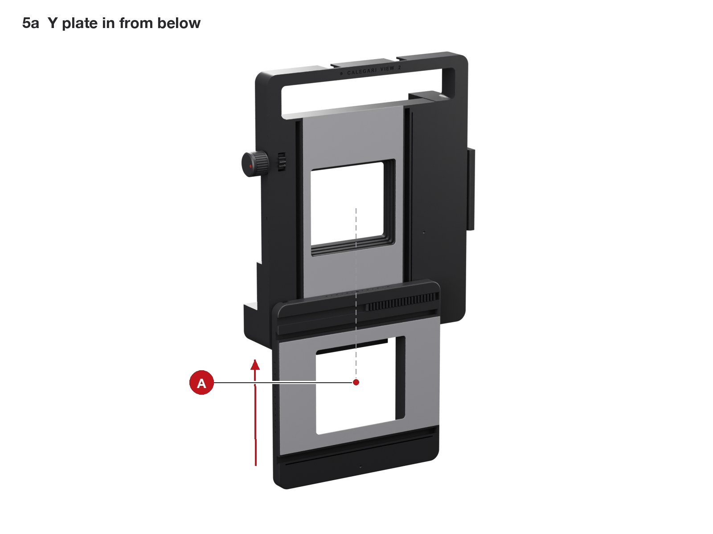

| | Part | What to do |
|---|---|---|
| A | Y plate | Hold it under the camera, rear toward the body, and slide it up into the body's two grooves from the bottom of the plinth. When the rack meets the pinion, turn the rise knob as you push: the teeth engage. Keep going until the plate stops at full rise. |

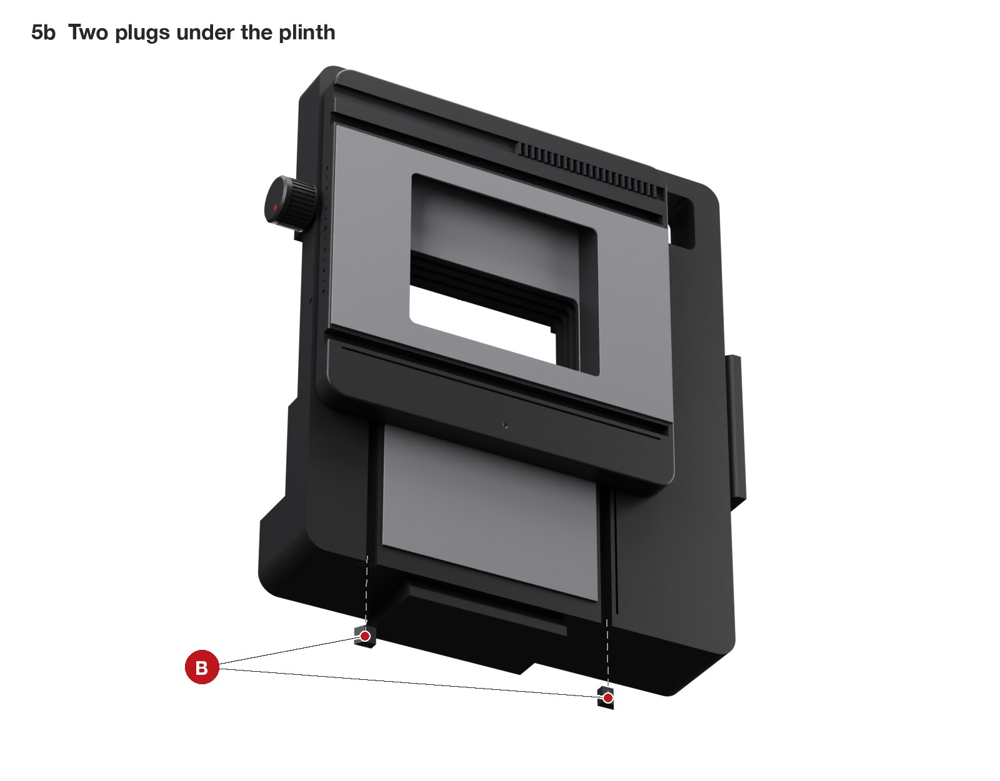

| | Part | What to do |
|---|---|---|
| B | Two plugs | Press them into the bottom ends of the two grooves, under the plinth, flush. They stop the fall and keep the plate in. |

Turn the rise knob through the whole travel: it should click once, at zero.

## 6. The shift pinion into the lens panel

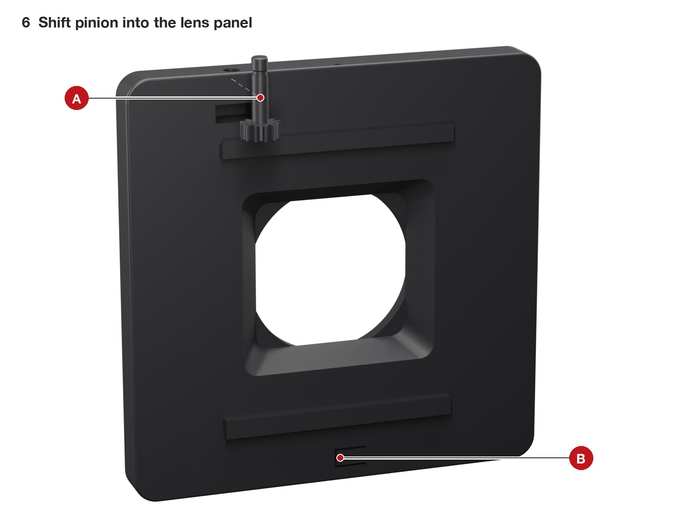

| | Part | What to do |
|---|---|---|
| A | Shift pinion | From behind, drop it into its pocket at the top of the panel and push the shaft up through the top edge. It stays loose until the panel is in. |
| B | Zero-click spring | As on the Y plate. |

## 7. The lens panel onto the Y plate

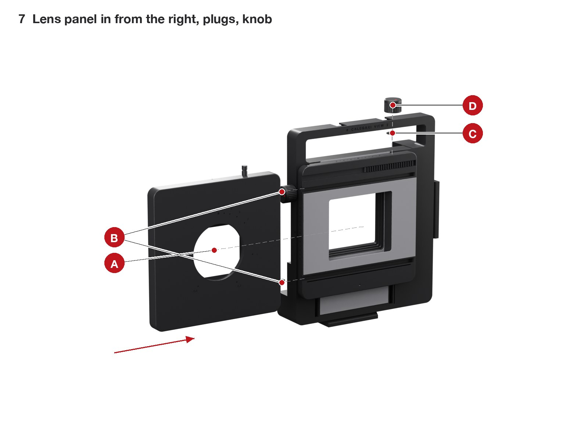

| | Part | What to do |
|---|---|---|
| A | Lens panel | Hold it with the pinion's shaft up and slide it into the Y plate's grooves from the photographer's right. The pinion runs in the channel at the top of the Y plate and meets the rack: rock the shaft with your fingers as you push, the teeth engage. Keep going until the panel stops. |
| B | Two plugs | Press them into the right-hand ends of the two grooves, flush. They stop the shift and keep the panel in. |
| C | Wave washer | Over the shaft, on the panel's top edge. |
| D | Knob | Onto the shaft until it clicks. |

The shift knob rides with the lens: turn it and the whole panel travels 37.7 mm per turn.

## 8. Helicoid and lens mount

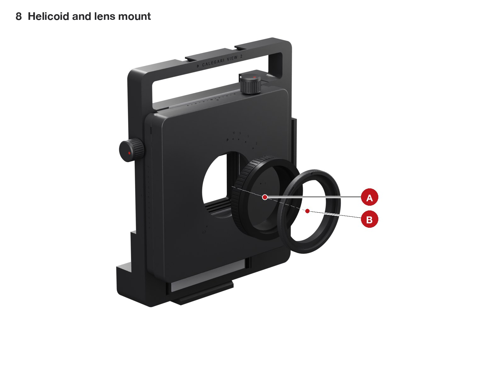

| | Part | What to do |
|---|---|---|
| A | Helicoid | Screw its rear thread into the panel's printed thread, by hand, until it seats. Hold the rear and turn the grip: the front must come out without rotating. |
| B | Lens mount | Screw it into the helicoid's front until it seats. |

## 9. The lens

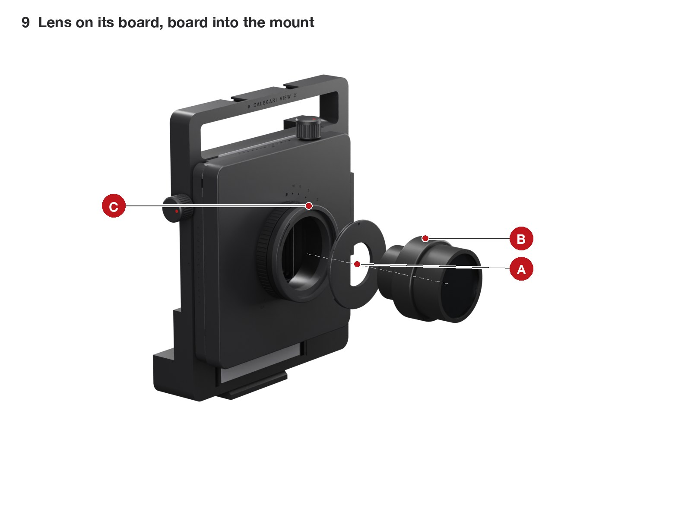

| | Part | What to do |
|---|---|---|
| A | Lens board | Put the lens's rear cell through the board from the front and tighten the retaining ring from behind, with the shutter's controls where you want them when the board is locked, red dot on top. |
| B | Lens | |
| C | Mount | Facing the front of the camera, put the board in turned about 40 degrees anticlockwise (its red dot left of the mount's), push it flat and turn it clockwise until it clicks: the red dots meet. To take it out, turn it back firmly. |

## 10. The back

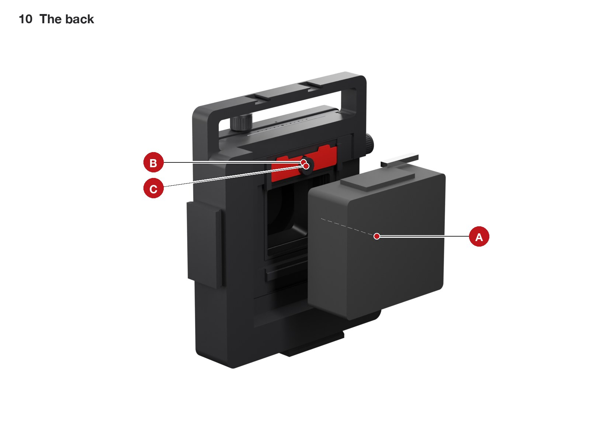

Wheel loose, blade down (B, C). Hook the back (A) under the module's bottom rail, swing it on, push the blade up and tighten the wheel. The dark slide comes out on the photographer's right.

## 11. Infinity and the index

1. Ground glass on, shutter open at full aperture, something far away in the frame (a kilometre is plenty).
2. Turn the helicoid's grip until the far object is sharp in the loupe. It will be a few degrees before the grip's closed stop: that margin is by design, as on any lens.
3. With a toothpick, put a drop of red acrylic on the grip, exactly under the red dot of the distance scale on the panel.

From now on the index shows the distance on the scale. If infinity is not reached before the stop, or it is more than a quarter turn before it, see [calibration](calibration.md).
