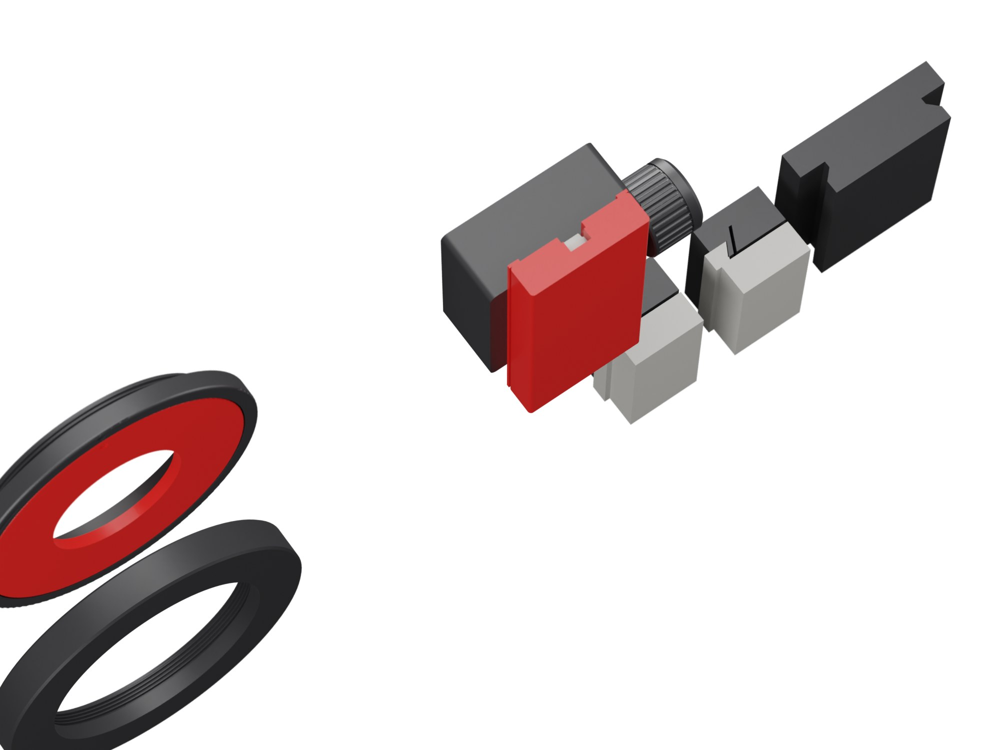

# Test prints

[Back to the project](../README.md)

Print these before anything else. They are the real mechanisms of View 2, or exact slices of them: a few hours of printing tell you whether the camera will work on your printer, before the body takes a day.

| Plate | Material | What |
|---|---|---|
| `plate_00a_shrink_gauge` | ASA | a 100 mm square frame: set the filament shrinkage first |
| `plate_00b_test_lens_drive` | ASA | M65 thread ring, lens mount, lens board; the shift rig (pinion with its shaft, knob, rack, pinion block, rack carrier); the rise rig (the top of the body's right side as a block, a short worm, the knob's gear, the collar, a knob, the plug, a rack slice) |
| `plate_00c_test_ways_arca` | ASA | dovetail grooves and tongues (rigid and flexure), a slice of the Arca dovetail |
| `plate_00d_test_tpu` | TPU 95A | two wave washers (external spool, not the AMS) |

Settings as for the camera ([printing](printing.md)), supports under the lens mount's ring only: 0.12 mm layers for the thread ring, the mount, the pinion, the worm and the knob's gear, 0.16 mm for the rest, 100 % infill for the small parts.

## Shrinkage first

Print the gauge, let it cool for ten minutes and measure the outside of the frame with a caliper, on both axes. If it is not 100.0 mm, set the shrinkage in the slicer (Bambu Studio: filament settings, *Shrinkage*, the measured value in percent) and print it again. Every part of the camera is drawn to size; a filament that shrinks 0.5 % turns a sliding fit into a stuck one.

## What to check

| Test | How | Good | If not |
|---|---|---|---|
| M65 thread | screw your helicoid's rear thread into the ring | by hand, no wobble, it seats flat | tight: raise `M65_FIT` by 0.1; loose: lower it |
| Focus direction | helicoid in the ring, look at it from the front and turn the grip toward close focus (the front comes out) | note which way it turns | clockwise: leave `FOCUS_DIR = 1`; anticlockwise: set `FOCUS_DIR = -1` before you print the lens panel, or the distance scale runs the wrong way |
| Mount | screw the mount into the helicoid's front | by hand, it seats flat | tune the stub in `mech.mount` |
| Bayonet | board in, turned 40 degrees back, then turn it to the stop | a click at the stop, no rattle, it comes out with a firm turn back | loose: `LUG_IN` +0.1; stiff click: the detent bump in `mech.mount` |
| Knob | shaft through the block, a wave washer over it, push the knob on | it snaps home and turns with an even, light drag | too free: `KNOB_OFF` -0.1; too stiff: +0.1 |
| Rise drive | the knob's gear into the block's side hole, the collar, a washer and a knob, as in [assembly](assembly.md) step 1; the worm up its bore from below, turning the knob as its gear meets the other, the plug under it, notch toward the channel; slide the rack slice up the channel from below, its rails on the block's face, and turn the knob as it meets the worm | the knob turns the worm with no scraping and draws the rack along, smooth, pi mm per turn; let go with a hand pushing on the slice: nothing moves | stiff: check the shrinkage; `WORM_BL` +0.05 (worm), `BEVEL_X` -0.1 (the two gears). It must never turn backwards under load: if it does, the worm or the rack is greasy, clean them |
| Rack and pinion | press the rack into the carrier's slot, teeth out; lay the carrier on the block, its two rails on the face; turn the knob | smooth, no skipped teeth, 37.7 mm per turn | rough: check the shrinkage first |
| Dovetails, rigid | slide the tongue in the plain groove | a light, even drag and no rocking | tight: `WAY_C_RIGID` +0.05 |
| Dovetails, flexure | the same in the slotted groove | a firm drag and no play at all, never binding | too firm: `WAY_INTERF` -0.05; play: +0.05 |
| Arca | clamp the coupon in your tripod head, tight | it holds and does not creep after a night | tell me: the fallback is a bought plate |

Every value above is in `cad/params.py` (or at the top of `cad/mech.py`). Change it and run `python testplate.py` again; when all pass, run `python export.py` for the camera.
